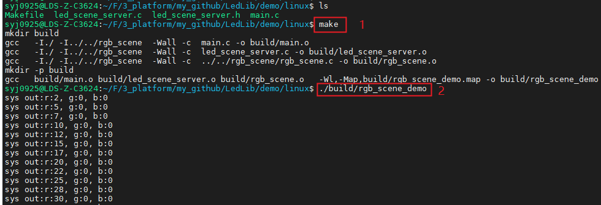

<h1 align="center"> LedLib</h1>

---------------------
LedLib存放的是LED和RGB灯的一些场景库，目前只有rgb_scene。

# 1. rgb_scene介绍

rgb_scene可以支持单色LED灯，也可以支持RGB三色灯。
通过定义不同led场景和运行优先级，可以满足各种各样的指示灯需求。

## 1.1. Action(动作)
Action是rgb_scene最小执行单元。rgb_scene支持三种Action。

```c
typedef struct
{
    uint16_t      rgb_mask;       /* rgb掩码 */
    uint16_t      cycle;          /* action循环次数，0xFFFF表示forever */
    action_type_t type;           /* 动作类型 */
    union
    {
        action_onoff_t onoff;     /* ON/OFF */
        action_blink_t blink;     /* 闪烁 */
        action_fade_t  fade;      /* 渐变 */
    } sub;
} action_t;
```

### 1.1.1. on/off(常亮/常灭)

```c
typedef struct
{
    rgb_value_t value;            /* RGB值 */
    uint16_t    lifetime;         /* 持续时间 */
} action_onoff_t;
```

### 1.1.2. blink(闪烁)
```c
typedef struct
{
    action_onoff_t action1;       /* blink上半个动作 */
    action_onoff_t action2;       /* blink下半个动作 */
} action_blink_t;
```

### 1.1.3. fade(渐变)

```c
typedef struct
{
    rgb_value_t start;            /* 渐变前RGB值 */
    rgb_value_t end;              /* 渐变后RGB值 */
    uint8_t     step;             /* 渐变拍数 */
    uint16_t    interval;         /* 时间间隔 */
} action_fade_t;
```

## 1.2. Scene(场景)

Scene就是由Action组合而成。通过组合不同的Action，可以实现复杂的应用场景。


如：红灯从0%亮度-渐变到100%亮度-停留(400毫秒)-在从100%亮度渐变到0%-停留(1秒) 然后就一直以上的循环。

```c
const rgb_scene_t c_sys_pairing_fail = {
    .cycle = 5,
    .num = 4,

    .action[0] = {
        .cycle = 1,
        .type = ACTION_FADE,
        .sub.fade.start.r = 0,
        .sub.fade.start.g = 0,
        .sub.fade.start.b = 0,
        .sub.fade.end.r = 0xFF,
        .sub.fade.end.g = 0,
        .sub.fade.end.b = 0,
        .sub.fade.step = 100,
        .sub.fade.interval = 10*RGB_MSEC,
    },
    .action[1] = {
        .cycle = 1,
        .type = ACTION_ONOFF,
        .sub.onoff.value.r = 0xFF,
        .sub.onoff.value.g = 0,
        .sub.onoff.value.b = 0,
        .sub.onoff.lifetime = 400*RGB_MSEC,
    },
    .action[2] = {
        .cycle = 1,
        .type = ACTION_FADE,
        .sub.fade.start.r = 0xFF,
        .sub.fade.start.g = 0,
        .sub.fade.start.b = 0,
        .sub.fade.end.r = 0,
        .sub.fade.end.g = 0,
        .sub.fade.end.b = 0,
        .sub.fade.step = 100,
        .sub.fade.interval = 10*RGB_MSEC,
    },
    .action[3] = {
        .cycle = 1,
        .type = ACTION_ONOFF,
        .sub.onoff.value.r = 0,
        .sub.onoff.value.g = 0,
        .sub.onoff.value.b = 0,
        .sub.onoff.lifetime = 1*RGB_SEC,
    },
};
```

## 1.3. Priority(优先级)

rgb_scene通过优先级来规范场景的执行顺序，每个scene必须指定一个优先级，多个Scene可以同个优先级。

## 1.4. Demo演示
编译和运行环境：ubuntu 18

### 1.4.1. 编译
* cd /demo/linux
* make

### 1.4.2 运行
* ./build/rgb_scene_demo





## 1.5. 应用说明

* 每个独立的led，创建对应的rgb_scene_obj_t对象
* 每个rgb_scene_obj_t对象需要定义对应的枚举->优先级和场景ID
* 根据优先级和场景ID，定义场景列表rgb_scene_tab_t
* 互斥的场景设置相同优先级，这样场景会相互替换
* 高优先级场景抢占低优先级场景，高优先级场景运行结束，会继续运行低优先级场景
* 设计原则，对于那种紧迫短暂的事件设为高优先级

## 1.6. 移植应用
* 拷贝LedLib文件夹到自己的工程源文件目录下
* IDE或者makefile文件中添加rgb_scene.c源文件，添加rgb_scene.h头文件文件路径
* 定义场景表rgb_scene_tab_t
* 调用RgbSceneObjCreate创建led/rgb对象
* 周期循环调用RgbSceneTick
* 调用RgbSceneStart来运行指定场景

p.s. 具体可以参考demo